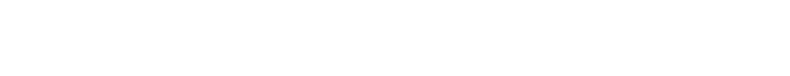

Example using the font [Pixel Operator](https://www.dafont.com/pixel-operator.font).

# How to use

## The files
You'll need to create 2 files.  
Both need to have the same name (For example : `PixelOperator.json` and `PixelOperator.png`)  
### The JSON file
The first one is a json file, it contains all the properties of the font you're gonna use.  
For example :
```json
{
  "Name": "Pixel Operator",
  "Height": 16,
  "SpaceLength": 4,
  "MinimumCharacterWidth": 5,
  "Characters": [
    "!',./:;<>I\\_`il|¡¦´·¸ÌÍÎÏìíîïı˚‘’‚",
    "-=ft°–•",
    "\"$&()*+0123456789?ABCDEFGHJKLNOPQRSTUVXYZ[]^abcdeghjknopqrsuvxyz{}¢¥¨¬±µ¿ÀÁÂÃÄÅÇÈÉÊËÐÑÒÓÔÕÖ×ØÙÚÛÜÝÞßàáâãäåçèéêëðñòóôõö÷øùúûüýþÿĈĉČčĎĚěĜĝĤĥĴĵŇňŘřŜŝŠšŤŬŭŮůŸŽžˆˇ˘“”„†‡",
    "#~£«»˜—",
    "%@MWmw©®¶…",
    "Æ挜",
    "ďť"
  ],
  "MissingCharacter": "?"
}
```  
`Name` is the name of the font  
`Height` is the height of the font (in pixels)  
`SpaceLength` is the length of a space (in pixels)  
`MinimumCharacterWidth` is the smallest width the font has (in pixels)  
`Characters` is the list of character.  
The first string should contain the characters that have a width of `MinimumCharacterWidth`
The second string should contain the characters that have a width of `MinimumCharacterWidth + 1`
etc.  
And `MissingCharacter` is the character that will be used if you try to print a character that doesn't exist in the font  

### The texture
The 2nd file is the texture.  
The texture will be of a very specific height : The `Height` multiplied by the number of strings in `Characters`, this is very important to avoid glitches !  
Imagine the texture as visual representation of the `Characters` table you wrote in the JSON above  
Example :  
  
Here, it is composed of 7 lines of 16 pixels.  
The first line contains the smallest (5px here) characters.  
The second line contains the 6px-large characters.  
The third contains the 7px-large ones.  
Etc. (Like in the `Characters` table in the JSON file)  
The width of the texture isn't important, as long as every line contains only characters of the respective size.

## The code

### Content Manager
After you created this, you might want to use it.  
First you'll open your Content.mgcb and import it the 2 files created before.  
Next, you'll change the `Build Action` of the JSON file to `Copy`.  

### Creating the variable
In your code, you create a new var of type `Font` :
```cs
Font yourFont = new Font(Game, FilePath);
```
`Game` is your main game's class
`FilePath` is the path to the files without extension
Example :
```cs
Font PixelOperator = new Font(this, "PixelOperator");
```
Then, after creating it, you'll have to load it (usually in your load method).

### Draw a text
To draw a text, you'll first have to begin your SpriteBatch.  
Then you'll do
```cs
yourFont.Draw(SpriteBatch, Text, Position, FontOptions);
```  
`SpriteBatch` is your SpriteBatch  
`Text` is your string (\n for breaking lines)  
`Position` is a Vector2 that represents the position in the SpriteBatch  
And `FontOptions` are the settings of your text : size, color, character spacing and line spacing.  

### Getting the size of a text 
You can get the size of a text (Vector2) by using :
```cs
yourFont.TextSize(Text, FontOptions);
```  
